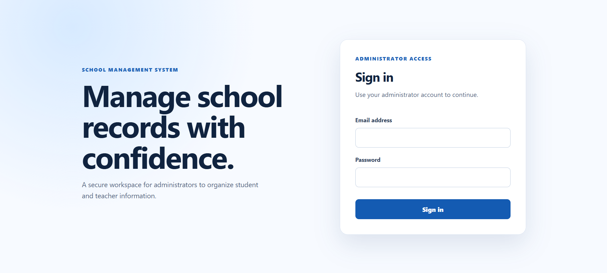
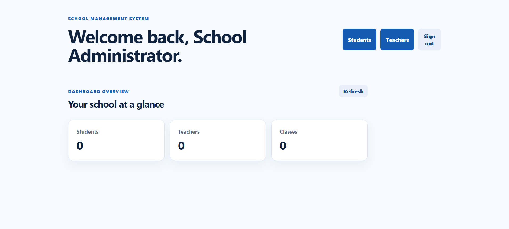
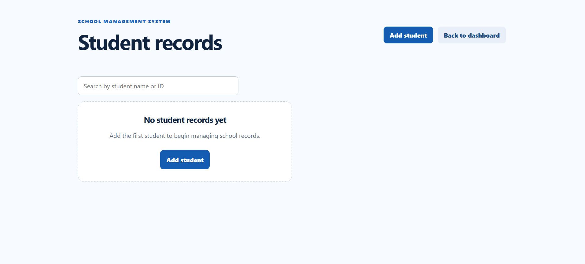
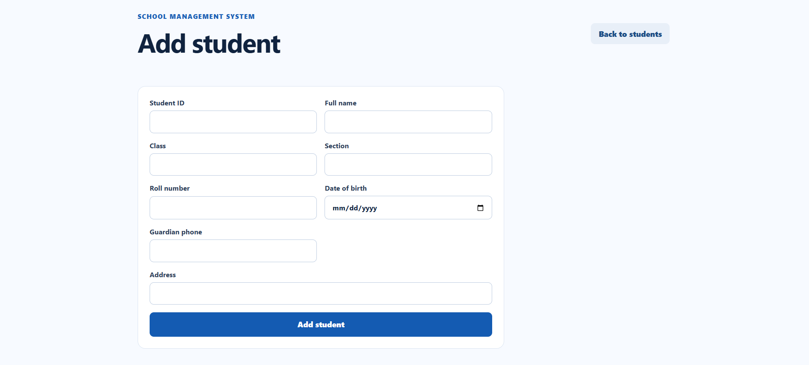
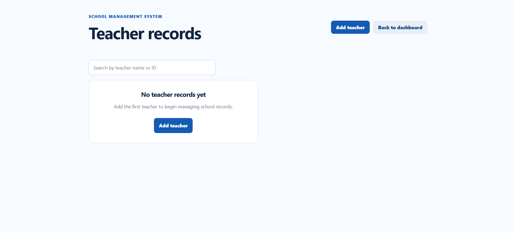
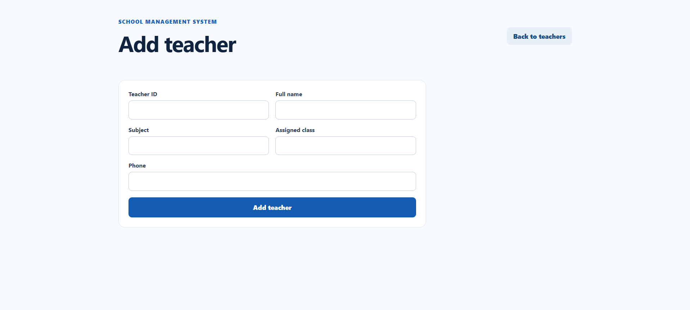
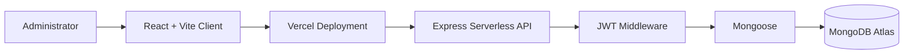
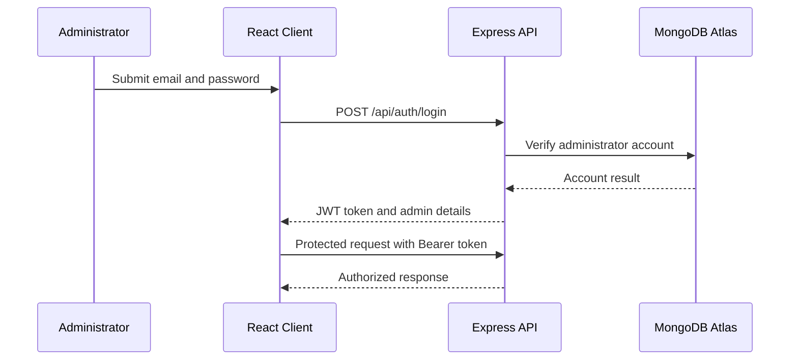

# School Management System

<p align="center">
  
  
  
  
  
  
  
</p>

<p align="center">
  <strong>A MERN Stack Student and Teacher Record Management Platform</strong><br />
  A secure, responsive workspace for school administrators to manage academic records efficiently.
</p>

<p align="center">
  <a href="https://school-management-system-client-livid.vercel.app">Live Demo</a> ·
  <a href="#features">Features</a> ·
  <a href="#run-locally">Local Setup</a> ·
  <a href="#api-overview">API</a>
</p>

<p align="center">
  
</p>

## Overview

School Management System is a full-stack web application built for school administrators. It provides authenticated access to a dashboard and makes student and teacher record management simple, organized, and secure.

**Live site:** [school-management-system-client-livid.vercel.app](https://school-management-system-client-livid.vercel.app)

## Application Screenshots

<p align="center">
  
  
</p>

<p align="center">
  
  
</p>

<p align="center">
  
</p>

| Screen | Description |
| --- | --- |
| Administrator login | Secure access to the management platform |
| Dashboard | Live student, teacher, and class summary |
| Student records | Search, add, edit, and delete student information |
| Teacher records | Search, add, edit, and delete teacher information |

## Features

- Secure administrator registration and login using JWT
- Protected administrator dashboard with live summary totals
- Student management: create, view, update, delete, and search records
- Teacher management: create, view, update, delete, and search records
- Clear empty states, confirmation before deleting, and manual dashboard refresh
- Persistent cloud database with MongoDB Atlas
- Production deployment on Vercel

## Technology Stack

| Layer | Technology |
| --- | --- |
| Frontend | React, Vite, CSS |
| Backend | Node.js, Express.js |
| Database | MongoDB Atlas with Mongoose |
| Authentication | JSON Web Token (JWT), bcrypt |
| Deployment | Vercel Serverless Functions |

<p align="center">
  
</p>

## System Architecture



The React client calls REST API routes under `/api`. Vercel serves the frontend and runs the Express API as serverless functions. Mongoose connects the API to MongoDB Atlas.

## Authentication Flow



The token is used only for protected administrator actions such as dashboard, student, and teacher record management.

## Project Structure

```text
school-management-system/
├── client/        # React + Vite frontend
├── server/        # Express API, routes, models, middleware
├── api/           # Vercel serverless route handlers
└── assets/        # README preview and application screenshots
```

## Run Locally

### 1. Install dependencies

```powershell
pnpm install
```

### 2. Configure environment variables

Create `server/.env`:

```text
PORT=5000
MONGODB_URI=your_mongodb_atlas_connection_string
JWT_SECRET=your_long_random_secret
CLIENT_URL=http://localhost:5173
```

> Never commit `.env`, database credentials, or JWT secrets.

### 3. Start the backend

```powershell
cd server
node src/index.js
```

### 4. Start the frontend

Open another terminal:

```powershell
cd client
.\node_modules\.bin\vite.cmd
```

Open [http://localhost:5173](http://localhost:5173).

## API Overview

| Method | Endpoint | Description |
| --- | --- | --- |
| GET | `/api/health` | API health check |
| POST | `/api/auth/register` | Create the first administrator account |
| POST | `/api/auth/login` | Sign in and receive a JWT |
| GET | `/api/dashboard/summary` | Get dashboard totals |
| GET/POST/PUT/DELETE | `/api/students` | Manage student records |
| GET/POST/PUT/DELETE | `/api/teachers` | Manage teacher records |

All record-management routes require a valid administrator JWT token.

## Data Models

| Model | Main fields |
| --- | --- |
| Administrator | Name, email, password hash |
| Student | Student ID, name, class, section, roll, date of birth, guardian phone, address |
| Teacher | Teacher ID, name, subject, assigned class, phone |

Passwords are stored as bcrypt hashes; plain-text passwords are not saved in the database.

## Deployment

The app is deployed on Vercel from the repository root. Configure these variables in Vercel for **Production** and **Preview**:

```text
MONGODB_URI=your_mongodb_atlas_connection_string
JWT_SECRET=your_long_random_secret
CLIENT_URL=https://school-management-system-client-livid.vercel.app
```

For Vercel connectivity, MongoDB Atlas must permit the deployment's network access.

## Cloudinary Image Storage

Cloudinary is **not enabled in the current version**. It is planned for a future release to store student profile photos and teacher photos securely in cloud storage. The planned flow is: image upload → Cloudinary URL saved in MongoDB → image displayed in the React profile page.

## Risks and Challenges

| Area | Challenge | Current approach |
| --- | --- | --- |
| Security | Secret exposure | Environment variables are kept outside GitHub |
| Authentication | Unauthorized API access | JWT middleware protects record routes |
| Deployment | Serverless API route handling | Vercel API handlers route requests to Express |
| Database | Cloud connection availability | MongoDB Atlas with connection error handling |
| Data quality | Duplicate IDs or missing fields | Schema validation and API validation |

## Testing Checklist

- [x] Administrator login and sign out
- [x] Dashboard statistics and refresh
- [x] Student CRUD and search
- [x] Teacher CRUD and search
- [x] MongoDB Atlas persistence
- [x] Vercel deployment and `/api/health` check

## Collaboration and Git Workflow

This is a solo university project. Development is organized through small, meaningful commits:

```text
Plan feature → Implement → Test locally → Commit → Push to GitHub main → Vercel deploys automatically
```

This keeps the commit history easy to understand and provides a clear record of project progress.

## Project Status

The core proposal scope is complete and deployed. Planned future enhancements include:

- Class and section management with dedicated CRUD screens
- Subject management and teacher-to-subject assignment
- Student and teacher profile photo upload with Cloudinary
- Attendance tracking by date, class, and section
- Marks, grade calculation, and result publishing
- Role-based accounts for administrator, teacher, and student
- Individual teacher and student dashboards
- Printable reports and PDF export
- Pagination, filters, and advanced search
- Password change, account recovery, and audit logs
- Mobile-first UI improvements and accessibility enhancements

---

Developed as a university Web Programming Lab project.
